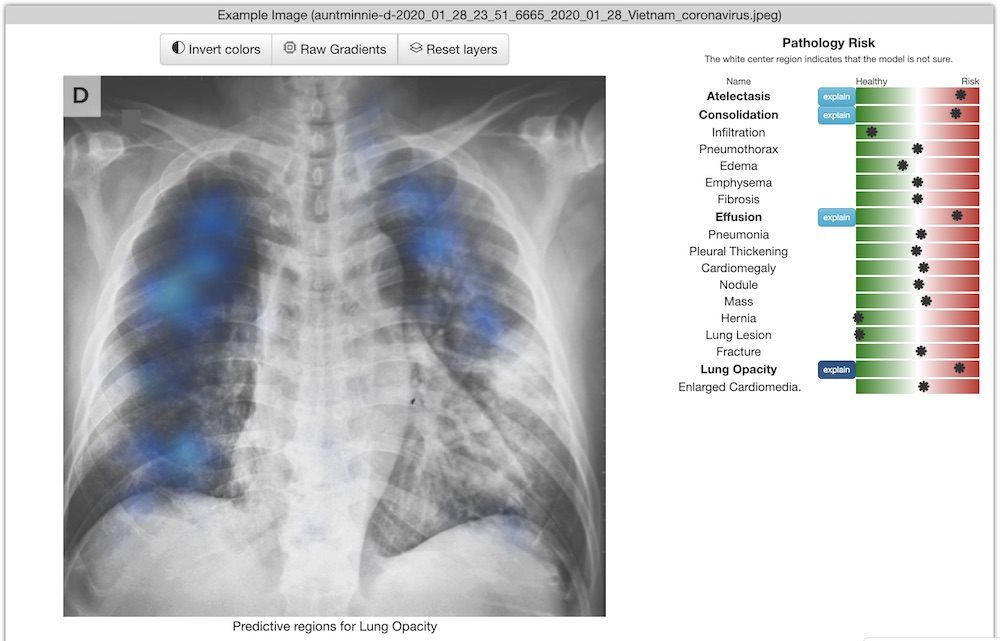

# Chester the AI Radiology Assistant

Source code or this page: https://mlmed.org/tools/xray/

NOT FOR MEDICAL USE. In order to bridge the gap between AI researchers and medical professionals we developed a very accessible free prototype system which can be used by medical professionals to understand the reality of Deep Learning tools for chest X-ray diagnostics. The system is designed to be a second opinion where a user can process an image to confirm or aid in their diagnosis. The tool predicts 18 different radiological findings based on data from the 7 largest public datasets. What makes this tool unique is that the web version runs entirely local and no data is sent off the device which allows this tool to scale to millions of users for free. The tool is available as a webpage which works on computers and mobile phones and with our new version 3 release we provide native windows and mac versions. The goals of this system are:

Demonstrate how AI systems work and their limitations.
Show the potential of open data (needed to build a public system like this).
Create a tool to help teach radiology.
Demonstrate a model delivery system that can scale to provide free medical tools to the world.

Publications:
- Chester: A Web Delivered Locally Computed Chest X-Ray Disease Prediction System, Joseph Paul Cohen and Paul Bertin and Vincent Frappier, arxiv, https://arxiv.org/abs/1901.11210
- On the limits of cross-domain generalization in automated X-ray prediction, Joseph Paul Cohen and Mohammad Hashir and Rupert Brooks and Hadrien Bertrand, Medical Imaging with Deep Learning, https://arxiv.org/abs/2002.02497
- A Benchmark of Medical Out of Distribution Detection, Tianshi Cao and Chinwei Huang and David Yu-Tung Hui and Joseph Paul Cohen, arxiv, https://arxiv.org/abs/2007.04250

A screenshot:

